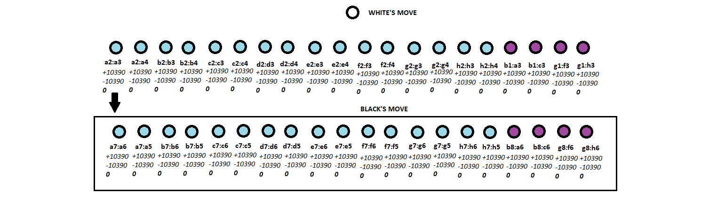

# 01: AI Strategy - Introduction to chess

In this module, we are going to look at **decision trees** which are a means for **AI** to make decisions about what actions to take. The application of these trees can take many forms depending on the context of the game; we are going to look at a very simple example of an AI weighing up all its options before making its 'move' - **Chess**! Now, Chess itself is not simple... and to play it well, you need a lot of knowledge and practice. But it provides a good example for us for a couple reasons: (1) the rules of the game are very well-defined - there are only certain legal moves that can be made at any turn, so this makes the options available easy to evaluate; and (2) it is turn-based, which will be easier for us to deal with than, say, a real-time game where the state-of-play is constantly updating.

## Starter project

Download the **starter code** for this game, which is a fully coded chess game, with all the legal moves etc, already prepared for you :)

## Decision trees

As the name suggests, the idea of **decision trees** are just trees (remember from last module: nodes and edges, in a hierarchical structure) that evaluate different scenarios and assign some sort of **weighting** to those scenarios, positive or negative. Let's consider a very basic example: the **AI** is deciding whether to move **left** or **right**. These form the nodes of the tree:


Now, in this scenario, to the left is a trap that will kill the AI instantly. On the right is a treasure that will reward the AI with 100 pieces of gold. So, the AI is considering a few variables in this move - its **health** and its **amount of gold**. A very simple **evaluation** of this could be something like this: moving **left** will **damage** the AI **100 health** (**-100**) and also yield **no new gold** (**+0**); moving **right** will **not damage** the AI at all (**-0**) and will yield **100 gold** (**+100**). So, the evaluation of each path might look like this to the AI:


It becomes very obvious what path the AI should take for this one step - the one with the **highest evaluation score**. Now, the things that factor into the **evaluation** can be as simple or complex as you want/need for your game. For example, let's say the **AI** has a shield that can mostly protect it from the trap; and let's say also that even **further** to the left is a very large treasure that is worth **1000 gold**. Its decision tree might look like this now:


Now the AI's best move **is** to go left, use its shield, and then move left again - this is where **AI** can become **"smarter"** than human players - the ability to *look ahead* and evaluate hundreds or thousands of options very quickly, and act in its best interest. This is how the first **computer chess** algorithms were able to beat human players. The ability of humans to consider all available options is difficult, especially if the **first option** acutally looks **immediately worse** but is eventually **the best move**.

## A chess algorithm - Minimax

The algorithm we are going to use in our chess program is a simple **decision tree** called **Minimax** - this algorithm looks at all possible moves by the AI **AND** then all possible moves by the player in response to those AI moves (and then, depending on the depth of the algorithm, again the AI, and again the player, etc, etc). The idea is to **maximise** the AI's score on its turn, but also **minimise** the player's score on its turn... 

This works especially well in chess because it is what we call a **zero-sum game**: first, it's two player, the game *has* an end, and there are 3 ways the game can end and they all 'equal' zero:
- you win (+1) and the opponent loses (-1); 
- you lose (-1) and the opponent wins (+1); 
- or neither of you win (a draw: +0 for both).

(Actually, most scholarly works will refer to positive infinity for a win and negative infinity for a loss, but this is a simplified explanation).

So, in its **simplest conception**, each move will determine if anyone 'wins' and attribute **+1**, **-1** or **0**... think about tic tac toe... each turn will eventually lead to one of these outcomes - the **Minimax algorithm** walks down the tree until it reaches an end node; it evaluates the end state and scores it **+1**, **-1** or **0**. Depending on which player's turn is being considered, the algorithm assigns either the **higher** or **lower** value back to the parent node (depending on whether it's **maximizing** or **minimizing**). It keeps alternating this pattern until it reaches the first node and identifies which path it should take. 


In chess there are **way more moves** that can be made than in tic tac toe. There are more ways to win/lose, and the pieces move in different ways (some being more 'dangerous' or 'powerful' than others). So we don't just work on **+1** or **-1** for our algorithm; instead we assign **weightings** to the pieces, and use those to determine the **score** of the board at each move. A common **scoring** for chess pieces is as follows (although this is by no means 'standard'; especially the **King** score varies according to different implementions... remember, a loss is supposed to be negative infinity, so we just need a really big number to use as that representation):

- **Pawn** 10
- **Knight** 30
- **Bishop** 30
- **Rook** 50
- **Queen** 90
- **King** 10000

The full set (for these values) generates the following score:

- **Pawn** 10 * 8 = **80**
- **Knight** 30 * 2 = **60**
- **Bishop** 30 * 2 = **60**
- **Rook** 50 * 2 = **100**
- **Queen** 90 * 1 = **90**
- **King** 10000 * 1 = **10000**
- **Total** = **10390**

### First moves

So - let's take a look at what the algorithm has to **consider** for its moves. For simplicity, we are going to **ignore** any **special moves** that are available in chess (such as castling, en passant, or promotion, etc). We will assume also **2 AI players**, again for simplicity - so we can show evaluations at both moves.

So, **white** moves first. **White** can move **10 pieces** on its opening move (the **8 Pawns** and the **2 Knights** are allowed to move; all other pieces are 'blocked').

So - there are **10 possible moves** to consider in its **decision tree**... but wait! Actually, **each Pawn** on its first turn is allowed to move **either 1 or 2 spaces**... so actually there are **16 possible moves** for the **Pawns** + **2 moves for the Knights** = **18 total moves**... nope, that's not right either! The **Knights** have **2 possible spots** they can move to on their opening move... so we're up to **20 possible openings in chess**. Already our decision tree has **20 possible nodes** to evaluate.


The algorithm will "make each move" and then evaluate the score of the board, adding up how many **white pieces** are still alive (+10390) and how many **black pieces** are still alive (-10390). Each of the **opening moves** comes to the same score of **0**, so it can choose any of these to make without **gaining** anything or **losing** anything. This algorithm has a **depth of 1**.

And that would be an **extremely stupid AI** if we stopped there... it would continue evaluating only its own moves each turn, and really only *doing something* if it could capture a piece - otherwise, its moves are kind of just 'random' (or as good as). It doesn't even look at whether it will **lose a piece** on the next turn!

So, we crank up its 'intelligence' by adding another **level** to the tree: now our algorithm has a **depth of 2**. Let's think about what that means: the algorithm will now 'move' each of the **black pieces** to see what would happen on the opponent's turn.




Again, there are **20 possible moves** that **black** can make as its opening... but it can make those 20 moves **in response** to each of **white's** moves! So **20 black moves** for moving **white's pawn** from **a2:a3**; **20 black moves** for moving **white's pawn** from **a2:a4**, and so on, and so on... that's **400 total moves** it calculates at a **depth of 2**. And still, every path for the opening returns a **score of 0** (I mean, it's the start of the game... not much is happening yet!)

What happens at a **depth of 3**? The algorithm will then try another move of the **white pieces** in response to each of the **black moves** - let's say another **20 moves per branch on the tree** (in actuality, it isn't exactly 20, as the pawns can only move 1 space after their first move; a moved pawn might now be blocking where a knight can move; a knight can move backwards so has more options after it is moved out, etc, etc...) For simplicity's sake, we'll say 20.

So now the algorithm is considering **8000 possible moves** just to make its first **white move**! Later, as the board opens up and pieces can start moving all sorts of places, the tree can grow very large! (for example, a **Queen**, if not blocked, can move ~20 moves all on its own!)

We will work with a **depth of 3** initially in our chess game - any more levels to the tree and you get **noticeable performance issues** as the algorithm tries **hundreds of thousands** to **millions** of combinations before making its move.

## Familiarise yourself with the chess code

We aren't going to write much of the actual chess game - all the board setup and move data has already been coded for you (it would just be too long to program all of this ourselves). But we need to know a little bit about what is included in the **starter code**:

### GameManager.cs

This script is the main script that runs the game. It starts off with a global `enum`:

```csharp
public enum PlayerTeam
{
    NONE = -1,
    WHITE,
    BLACK,
};
```

We use this as an easy way to say what team is currently playing: **whtie** or **black**. 

Next comes the `GameManager` class, and several variables:

```csharp
BoardManager board;
public PlayerTeam playerTurn;
bool kingDead = false;

public GameObject fromHighlight;
public GameObject toHighlight;

private static GameManager instance;    
public static GameManager Instance
{
    get { return instance; }
}
    
private bool isCoroutineExecuting = false;
```

The first variable `BoardManager board` is a reference to the `BoardManager` script - a lot of things in this game won't be instantiated, but rather the scripts will be marked as `static` and their methods called from the one instance - this pattern is known as a **singleton pattern** as one instance only is required - we'll see it implemented in a second.

`public PlayerTeam playerTurn` is used to say whose turn it currently is.

`bool kingDead = false` is a flag for when the game is over; while this is `false` the game will keep going.

`fromHighlight` and `toHighlight` are materials that are assigned in the inspector - they appear on the board to show the piece moves.

`private static GameManager instance` is the **singleton** instance for this class; it is `private`, and a `public` version called `Instance` is declared for accessing it from other scripts. Note that we don't need a `set` method because we **don't want to** set it from anywhere else.

`private bool isCoroutineExecuting = false` is a flag we will use in a **coroutine** below - this is purely to add a **delay** to the game so we can watch the moves play out... otherwise it would go too fast and we wouldn't be able to tell what was happening.

In the `Awake` method we set the `instance` to this (the **singleton**) - we'll see this pattern a few times in the code, so we won't look at it each time - it always does the same thing.

```csharp
private void Awake()
{
    if (instance == null)        
        instance = this;        
    else if (instance != this)        
        Destroy(this);    
}  
```

The `Start` method sets up the board:

```csharp
void Start()
{
    board = BoardManager.Instance;        
    board.SetupBoard();
}
```

And the `Update` runs the coroutine mentioned above:

```csharp
private void Update()
{
    StartCoroutine(DoAIMove());
}
```

The couroutine itself is what runs the actual game:

```csharp
IEnumerator DoAIMove()
{       
    if(isCoroutineExecuting)
        yield break;

    isCoroutineExecuting = true;

    if (kingDead)                    
        Debug.Log(playerTurn + " wins!");        
    else if (!kingDead)
    {                     
        MoveFunction movement = new MoveFunction(board);
        MoveData move = null;
        for (int y = 0; y < 8; y++)                
            for (int x = 0; x < 8; x++)            
            {
                TileData tile = board.GetTileFromBoard(new Vector2(x, y));
                if(tile.CurrentPiece != null && tile.CurrentPiece.Team == playerTurn)
                {
                    List<MoveData> pieceMoves = movement.GetMoves(tile.CurrentPiece, tile.Position);
                    if(pieceMoves.Count > 0)                        
                        move = pieceMoves[0];                        
                }
            }

        RemoveObject("Highlight");
        ShowMove(move);

        yield return new WaitForSeconds(1);

        SwapPieces(move);  
        if(!kingDead)                
            UpdateTurn();     

        isCoroutineExecuting = false;                                                                                                         
    }
}
```

This code first checks if the coroutine is already running; if so, don't try to run it again.

Next, it checks whether the game is over (`kingDead`) - if not, it will make a move for the current `playerTurn`.

`MoveFunction movement` is a script with all the legal moves of the pieces. At the moment, our logic for making a move is **extrememly rudimentary**... all it does is iterate through the squares on the board and takes the first piece of the current `playerTurn` that can make a legal move... and moves it the first of its legal moves. That's it. Whatever it comes across first that it can move it will... so, not a very thrilling match!

The `RemoveObject("Highlight")` gets rid of the previous 'move highlights'.

`ShowMove(move)` instantiates new highlights for the current move.

`yield return new WaitForSeconds(1)` is what creates a delay in the coroutine.

`SwapPieces(move)` actual makes the move.

Then the code checks if the game is now over following the current move - if the game is not over, it switches the `playerTurn` to the opponent team.

Finally, we set `isCoroutineExecuting` back to false so that the coroutine can fire the next time `Update` gets called.

### BoardManager.cs

This script maintains the state of the board, in terms of managing all the 'tiles' (see below).

### TileData.cs

The **board** is a 2D array of `TileData` - each `TileData` has information about the tile's position on the board, and what piece (if any) is on the tile.

### MoveFunction.cs

This script, as mentioned, returns a list of legal moves for a given piece.

### ChessPiece.cs

This is a really basic script that holds some info for a given piece (mostly information about its position and where it's moving to).

### MoveData.cs

This script holds some data about moves - what tile they move from, what tile they move to, and whether a piece was already on the tile being moved to (`pieceKilled`).
